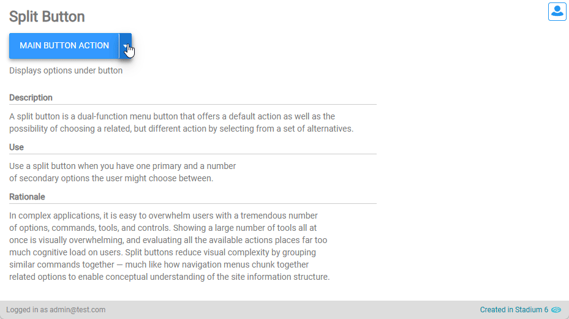

# Split Buttons

In complex applications, it is easy to overwhelm users with a large number of options and controls. Split buttons reduce visual complexity by grouping similar actions together. Use Split Buttons when you want users to choose between multiple related actions, one of which is most frequently used. 



## Version 
1.1 - [Added display option under dropdown via additional class](#display-options)

1.2 Removed display-right option; Updated readme for 6.12+; Converted px to rem

# Setup

## Application Setup
1. Check the *Enable Style Sheet* checkbox in the application properties

## Global Script Setup
1. Create a Global Script called "SplitButtons"
3. Drag a *JavaScript* action into the script
4. Add the Javascript below unchanged into the JavaScript code property
```javascript
/* Stadium Script Version 1.2 https://github.com/stadium-software/split-button */
initSplitButtons();
function initSplitButtons() {
    let splitbuttons = document.querySelectorAll(".stadium-split-button");
    for (let i = 0; i < splitbuttons.length; i++) {
        let btnContainer = splitbuttons[i].querySelector(".button-container");
        let btn = splitbuttons[i].querySelector("button");
        let options = splitbuttons[i].querySelectorAll(".drop-down-container select option");
        let ddContainer = document.createElement("div");
        ddContainer.classList.add("split-options");
        for (let j = 0; j < options.length; j++) {
            let option = document.createElement("div");
            option.classList.add("split-option");
            option.innerHTML = options[j].text;
            option.setAttribute("value", options[j].value);
            option.addEventListener("click", showSplitButton);
            ddContainer.appendChild(option);
        }
        let rightButton = splitbuttons[i].querySelector(".right-button");
        if (!rightButton) {
            rightButton = document.createElement("div");
            rightButton.classList.add("right-button");
            rightButton.addEventListener("click", function (e) {
                if (!e.target.parentNode.closest(".split-options")) e.target.closest(".stadium-split-button").classList.toggle("expanded");
            });
            btnContainer.appendChild(rightButton);
        }
        if (splitbuttons[i].querySelector(".split-options")) {
            splitbuttons[i].querySelector(".split-options").remove();
        }
        rightButton.appendChild(ddContainer);
        btn.addEventListener("click", closeSplitButton);
        document.body.addEventListener("click", closeSplitButtons);
    }
}
function showSplitButton(e) {
    let splitButton = e.target.closest(".stadium-split-button");
    let select = splitButton.querySelector(".drop-down-container select");
    select.value = e.target.getAttribute("value");
    select.dispatchEvent(new Event("change"));
    splitButton.classList.remove("expanded");
}
function closeSplitButtons(e) {
    let splitbuttons = document.querySelectorAll(".stadium-split-button");
    for (let i = 0; i < splitbuttons.length; i++) {
        if (e.target.closest(".stadium-split-button") != splitbuttons[i]) {
            splitbuttons[i].classList.remove("expanded");
        }
    }
}
function closeSplitButton(e) {
    e.target.closest(".stadium-split-button").classList.remove("expanded");
}
```

## Page Setup
1. Drag a *Container* control into the page 
2. Add a class called "stadium-split-button" into the *Container* classes property
3. Drag a *Button* control into the *Container* control
4. Add the text you wish to show on the button into the button text property
5. Drag a *DropDown* control and place it into the *Container* control to the right of the *Button* control
6. Add the *Options* you wish in the split button to the *DropDown* control or assign options using a script


## Page.Load Event Setup
1. Drag the global script called "SplitButtons" into the Page.Load event handler
2. Place the script after the actions that populate the dropdown with dynamic values

## CSS
The CSS below is required for the correct functioning of the module. Variables exposed in the [*split-buttons-variables.css*](split-buttons-variables.css) file can be [customised](#customising-css).

### Before v6.12
1. Create a folder called "CSS" inside of your Embedded Files in your application
2. Drag the two CSS files from this repo [*split-buttons-variables.css*](split-buttons-variables.css) and [*split-buttons.css*](split-buttons.css) into that folder
3. Paste the link tags below into the *head* property of your application
```html
<link rel="stylesheet" href="{EmbeddedFiles}/CSS/split-buttons.css">
<link rel="stylesheet" href="{EmbeddedFiles}/CSS/split-buttons-variables.css">
``` 

### v6.12+
1. Create a folder called "CSS" inside of your Embedded Files in your application
2. Drag the CSS files from this repo [*split-buttons.css*](split-buttons.css) into that folder
3. Paste the link tag below into the *head* property of your application
```html
<link rel="stylesheet" href="{EmbeddedFiles}/CSS/split-buttons.css">
``` 

### Customising CSS
1. Open the CSS file called [*split-buttons-variables.css*](split-buttons-variables.css) from this repo
2. Adjust the variables in the *:root* element as you see fit
3. Stadium 6.12+ users can comment out any variable they do **not** want to customise
4. Add the [*split-buttons-variables.css*](split-buttons-variables.css) to the "CSS" folder in the EmbeddedFiles (overwrite)
5. Paste the link tag below into the *head* property of your application (if you don't already have it there)
```html
<link rel="stylesheet" href="{EmbeddedFiles}/CSS/split-buttons-variables.css">
``` 
6. Add the file to the "CSS" inside of your Embedded Files in your application

**NOTE: Do not change any of the CSS in the 'split-buttons.css' file**

## Upgrading Stadium Repos
Stadium Repos are not static. They change as additional features are added and bugs are fixed. Using the right method to work with Stadium Repos allows for upgrading them in a controlled manner. 

How to use and update application repos is described here: [Working with Stadium Repos](https://github.com/stadium-software/samples-upgrading)