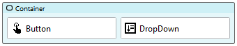

# Split Buttons

In complex applications, it is easy to overwhelm users with a large number of options and controls. Split buttons reduce visual complexity by grouping similar actions together. Use Split Buttons when you want users to choose between multiple related actions, one of which is most frequently used. 

https://github.com/stadium-software/split-button/assets/2085324/2729d416-e90e-4d77-8b84-b819ea50be10

## Version 
1.0 - initial

# Setup

## Application Setup
1. Check the *Enable Style Sheet* checkbox in the application properties

## Global Script Setup
1. Create a Global Script called "SplitButtons"
3. Drag a *JavaScript* action into the script
4. Add the Javascript below into the JavaScript code property (ignore the validation error message "Invalid script was detected")
```javascript
/*Stadium Script Version 1.0*/
initSplitButtons();
function initSplitButtons() {
    let splitbuttons = document.querySelectorAll(".stadium-split-button");
    for (let i = 0; i < splitbuttons.length; i++) {
        let btnContainer = splitbuttons[i].querySelector(".button-container");
        let btn = splitbuttons[i].querySelector("button");
        let options = splitbuttons[i].querySelectorAll(".drop-down-container select option");
        let ddContainer = document.createElement("div");
        ddContainer.classList.add("split-options");
        for (let j = 0; j < options.length; j++) {
            let option = document.createElement("div");
            option.classList.add("split-option");
            option.innerHTML = options[j].text;
            option.setAttribute("value", options[j].value);
            option.addEventListener("click", showSplitButton);
            ddContainer.appendChild(option);
        }
        let rightButton = splitbuttons[i].querySelector(".right-button");
        if (!rightButton) {
            rightButton = document.createElement("div");
            rightButton.classList.add("right-button");
            rightButton.addEventListener("click", function (e) {
                if (!e.target.parentNode.closest(".split-options")) e.target.closest(".stadium-split-button").classList.toggle("expanded");
            });
            btnContainer.appendChild(rightButton);
        }
        if (splitbuttons[i].querySelector(".split-options")) {
            splitbuttons[i].querySelector(".split-options").remove();
        }
        rightButton.appendChild(ddContainer);
        btn.addEventListener("click", closeSplitButton);
        document.body.addEventListener("click", closeSplitButtons);
    }
}
function showSplitButton(e) {
    let splitButton = e.target.closest(".stadium-split-button");
    let select = splitButton.querySelector(".drop-down-container select");
    select.value = e.target.getAttribute("value");
    select.dispatchEvent(new Event("change"));
    splitButton.classList.remove("expanded");
}
function closeSplitButtons(e) {
    let splitbuttons = document.querySelectorAll(".stadium-split-button");
    for (let i = 0; i < splitbuttons.length; i++) {
        if (e.target.closest(".stadium-split-button") != splitbuttons[i]) {
            splitbuttons[i].classList.remove("expanded");
        }
    }
}
function closeSplitButton(e) {
    e.target.closest(".stadium-split-button").classList.remove("expanded");
}
```

## Page Setup
1. Drag a *Container* control into the page and add a class called "stadium-split-button" into the classes property
2. Drag a *Button* control into the *Container* control
3. Add any text you wish into the button  text property
4. Drag a *DropDown* control and place it into the *Container* control to the right of the *Button* control
5. Add any *Options* you wish to the *DropDown* control or assign options using a script



## Page.Load Event Setup
1. Drag the global script called "SplitButtons" into the Page.Load event handler

# Styling
Various elements in this module can be styled using the two CSS files in this repo

## Applying the CSS

**Stadium 6.6 or higher**
1. Create a folder called "CSS" inside of your Embedded Files in your application
2. Drag the two CSS files from this repo [*split-buttons-variables.css*](split-buttons-variables.css) and [*split-buttons.css*](split-buttons.css) into that folder
3. Paste the link tags below into the *head* property of your application
```html
<link rel="stylesheet" href="{EmbeddedFiles}/CSS/split-buttons.css">
<link rel="stylesheet" href="{EmbeddedFiles}/CSS/split-buttons-variables.css">
``` 


**Versions lower than 6.6**
1. Copy the CSS from the two css files into the Stylesheet in your application

## Customising CSS
1. Open the CSS file called [*split-buttons-variables.css*](split-buttons-variables.css) from this repo
2. Adjust the variables in the *:root* element as you see fit
3. Overwrite the file in the CSS folder of your application with the customised file

## CSS Upgrading
To upgrade the CSS in this module, follow the [steps outlined in this repo](https://github.com/stadium-software/samples-upgrading)
